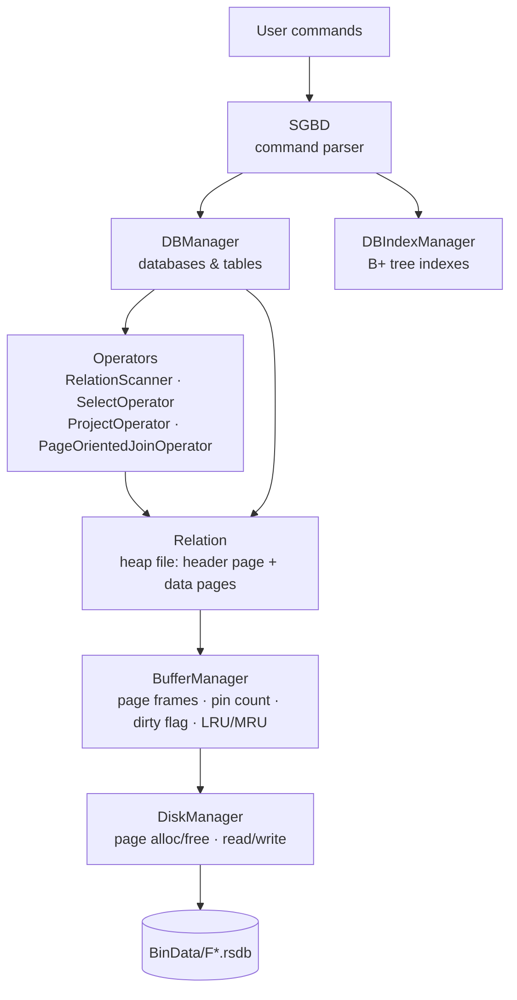

# Mini DBMS: a relational database engine in Java

A small **relational database management system built from scratch in Java**, with no database library underneath. It stores tables in binary page files on disk, caches pages in a buffer pool, and runs a SQL-like command language with selections, projections, joins and B+ tree indexes.

University project for the *Bases de Données Avancées* (BDDA) course, Licence Informatique, Université Paris Cité, 2024.

```text
? CREATE DATABASE School
? SET DATABASE School
? CREATE TABLE Students (id:INT,name:VARCHAR(20),grade:REAL)
? INSERT INTO Students VALUES (5,"Emma",17.0)
? SELECT s.name,s.grade FROM Students s WHERE s.grade>=15
"Emma" ; 17.0 ;
"Alice" ; 19.5 ;
"Chloe" ; 15.25 ;
Total records: 3
```

---

## Features

- **Disk manager**: fixed-size pages stored in binary files (`F0.rsdb`, `F1.rsdb`, …), page allocation and deallocation, and a free-page list that persists across runs.
- **Buffer manager**: a pool of in-memory page frames with pin counts, dirty flags and an **LRU** or **MRU** replacement policy.
- **Heap-file tables**: each table has a header page that lists its data pages and their free space. Records live in **slotted pages**, and both fixed-size (`CHAR`) and variable-size (`VARCHAR`) columns are supported.
- **Several databases**: create, switch between, list and drop databases and tables. The schema survives a restart.
- **Query operators** in the iterator (Volcano) model:
  - full table scan
  - selection with `WHERE` (`=`, `<>`, `<`, `>`, `<=`, `>=`, combined with `AND`)
  - projection
  - **nested-loop join** across several tables
- **B+ tree index** on a column, for fast equality lookups.
- **Bulk loading** from CSV files.

---

## Architecture



| Layer | Classes | Role |
|---|---|---|
| Command layer | `SGBD` | Reads commands from the console, parses them and calls the right manager |
| Catalog | `DBManager`, `Database` | Keeps track of databases and their tables, saved to `databases.save` on `QUIT` |
| Tables & records | `Relation`, `ColInfo`, `ColType`, `Record`, `RecordId` | Schema, serializing records to bytes, inserting into and reading from data pages |
| Query execution | `IRecordIterator`, `RelationScanner`, `DataPageHoldRecordIterator`, `PageDirectoryIterator`, `SelectOperator`, `ProjectOperator`, `PageOrientedJoinOperator`, `Condition`, `RecordPrinter` | Iterators that scan, filter, project, join and print records |
| Indexing | `BPlusTree`, `BPlusTreeNode`, `DBIndexManager` | B+ tree built on one column of a table |
| Buffer pool | `BufferManager`, `Buffer` | Caches pages in memory and writes dirty pages back when they are evicted or flushed |
| Storage | `DiskManager`, `PageId`, `DBConfig` | Page files on disk, free-page list (`dm.save`), configuration |

### On-disk page layout

**Header page** (one per table):

```
[ nbDataPages ][ fileIdx | pageIdx | freeSpace ][ fileIdx | pageIdx | freeSpace ] ...
     4 B              12 B per data page
```

**Data page**, a slotted page. Records grow from the start of the page, and the slot directory grows backwards from the end:

```
[ record 0 ][ record 1 ] ...  free space  ... [ slot 1: pos,len ][ slot 0: pos,len ][ nbSlots ][ freeStart ]
                                                     8 B each                          4 B        4 B
```

A `RecordId` is `(PageId, slotIdx)`. A `PageId` is `(fileIdx, pageIdx)`.

---

## Getting started

### Requirements

- **JDK 21 or later**: the code uses switch expressions and pattern matching. `pom.xml` targets Java 22.
- The `json-simple` library, already included in `lib/`.

### Configuration

`configDB.json` sets where the data lives and how the engine behaves:

```json
{
  "dbpath": "./BinData",
  "pagesize": 1024,
  "dm_maxfilesize": 102400,
  "bm_buffercount": 10,
  "bm_policy": "LRU"
}
```

| Key | Meaning |
|---|---|
| `dbpath` | Folder for the page files and saved state (created if it doesn't exist) |
| `pagesize` | Page size in bytes |
| `dm_maxfilesize` | Maximum size of one `.rsdb` file before a new one is started |
| `bm_buffercount` | Number of frames in the buffer pool |
| `bm_policy` | Replacement policy: `LRU` or `MRU` |

### Run

**Windows**

```bat
MiniSGBD.bat configDB.json
```

**Linux / macOS**

```bash
sh MiniSGBD.sh configDB.json
```

Both scripts compile the sources, then start the interactive prompt `? `. To compile and run by hand:

```bash
javac -cp lib/json-simple-1.1.1.jar -d bin src/main/java/org/example/*.java
java  -cp bin:lib/json-simple-1.1.1.jar org.example.SGBD configDB.json      # Linux/macOS
java  -cp "bin;lib/json-simple-1.1.1.jar" org.example.SGBD configDB.json    # Windows
```

Always leave with **`QUIT`**. That is when the catalog and the free-page list are written to disk.

---

## Command reference

> ⚠️ The parser splits commands on spaces. **Don't put spaces inside the parentheses** of `CREATE TABLE` and `INSERT`, or around operators in `WHERE`. Write `FROM`, `WHERE` and `AND` in uppercase.

### Databases and tables

| Command | Example |
|---|---|
| `CREATE DATABASE <name>` | `CREATE DATABASE School` |
| `SET DATABASE <name>` | `SET DATABASE School` |
| `LIST DATABASES` | |
| `CREATE TABLE <name> (<col>:<type>,...)` | `CREATE TABLE Students (id:INT,name:VARCHAR(20),grade:REAL)` |
| `LIST TABLES` | |
| `DROP TABLE <name>` / `DROP TABLES` | Drop one table or all tables of the current database |
| `DROP DATABASE <name>` / `DROP DATABASES` | Drop one database or all of them |
| `QUIT` | Save the state and exit |

Column types: `INT`, `REAL` (float), `CHAR(n)` (fixed size, padded) and `VARCHAR(n)` (variable size).

### Inserting data

```text
INSERT INTO Students VALUES (5,"Emma",17.0)
BULKINSERT INTO Students students.csv
```

The CSV file has one record per line, in the same format as `VALUES`, with strings in double quotes:

```text
1,"Alice",19.5
2,"Bob",12.0
```

### Querying

```text
SELECT * FROM <table> <alias>
SELECT <alias>.<col>,... FROM <table> <alias>[,<table> <alias>...] [WHERE <cond> AND <cond> ...]
```

A condition has the form `<term><op><term>`, where a term is either `alias.column` or a constant. The operators are `=`, `<>`, `<`, `>`, `<=` and `>=`. Results print at most 30 rows, followed by the total count.

**Selection and projection:**

```text
? SELECT s.name,s.grade FROM Students s WHERE s.grade>=15
"Emma" ; 17.0 ;
"Alice" ; 19.5 ;
"Chloe" ; 15.25 ;
Total records: 3
```

**Join:**

```text
? SELECT s.name,c.course FROM Students s,Courses c WHERE s.id=c.sid
"Alice" ; "Java" ;
"Bob" ; "Databases" ;
"Chloe" ; "Java" ;
Total records: 3
```

### Indexes

```text
CREATEINDEX ON <table> KEY=<column> ORDER=<order>
SELECTINDEX * FROM <table> WHERE <column>=<value>
```

```text
? CREATEINDEX ON Students KEY=id ORDER=3
? SELECTINDEX * FROM Students WHERE id=3
3 ; Chloe ; 15.25 ;
B+ search : Total records : 1
```

---

## Full example session

```text
? CREATE DATABASE School
? SET DATABASE School
? CREATE TABLE Students (id:INT,name:VARCHAR(20),grade:REAL)
? CREATE TABLE Courses (sid:INT,course:CHAR(10))
? INSERT INTO Students VALUES (5,"Emma",17.0)
? BULKINSERT INTO Students students.csv
? BULKINSERT INTO Courses courses.csv
? LIST TABLES
Students[id:INT, name:VARCHAR(20), grade:REAL]
Courses[sid:INT, course:CHAR(10)]
? SELECT * FROM Students s
5 ; "Emma" ; 17.0 ;
1 ; "Alice" ; 19.5 ;
2 ; "Bob" ; 12.0 ;
3 ; "Chloe" ; 15.25 ;
4 ; "David" ; 8.75 ;
Total records: 5
? QUIT
```

After `QUIT`, the data folder contains:

```
BinData/
├── F0.rsdb          # page file(s)
├── databases.save   # catalog: databases, tables, schemas
└── dm.save          # free-page list
```

The next time you start the program, `SET DATABASE School` gives you back your tables and data.

---

## Project structure

```
.
├── src/
│   ├── main/java/org/example/   # engine source code (25 classes)
│   └── test/java/               # test programs, one per component
├── lib/json-simple-1.1.1.jar    # JSON parser for configDB.json
├── configDB.json                # default configuration
├── MiniSGBD.bat / MiniSGBD.sh   # compile + run scripts
└── pom.xml                      # Maven project file
```

### Tests

The classes in `src/test/java` are standalone programs with a `main` method, one per component (`DiskManagerTests`, `BufferManagerTest`, `RelationTest`, `IteratorTest`, `BPlusTreeTest`, …). They don't use JUnit. To run one:

```bash
javac -cp lib/json-simple-1.1.1.jar -d bin src/main/java/org/example/*.java src/test/java/*.java
java  -cp bin:lib/json-simple-1.1.1.jar BPlusTreeTest
```

Some of them load configuration files from a `files/` folder that isn't in the repository.

---

## Limitations

- No `UPDATE` or `DELETE` on records.
- B+ tree indexes are kept **in memory only**, so you need to recreate them after a restart. They support equality lookups only.
- The parser is simple: no spaces inside value lists, uppercase keywords, and no quoted strings that contain commas or spaces.
- The join is a plain nested loop, and there is no query optimizer.

---

## Authors

- **Thi Chau**
- **Zineb Fennich**
- **Omar Amara**
